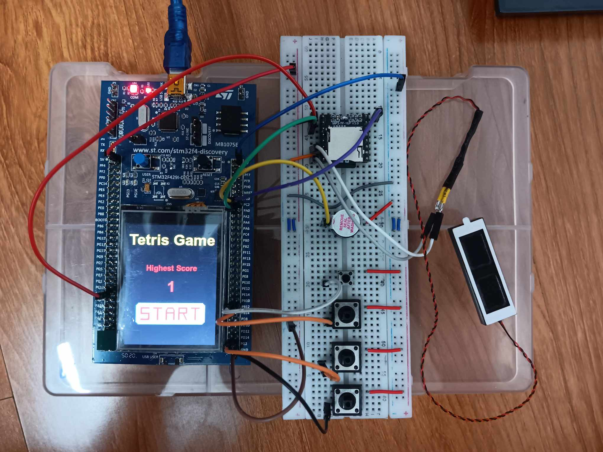
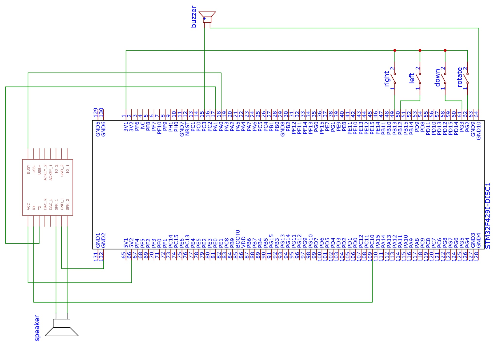

## GIỚI THIỆU

__Đề bài__: Game Tetris

__Sản phẩm:__
1. Tính năng
2. Tính năng
3. Tính năng



## TÁC GIẢ

- Tên nhóm: __Blink red__
- Thành viên trong nhóm
  |STT|Họ tên|MSSV|Công việc|
  |--:|--|--|--|
  |1|Kiều Văn Bảo|20225261||
  |2|Trần Duy Anh|20225256||
  |3|Vũ Tiến An Nguyên|20225148||

## MÔI TRƯỜNG HOẠT ĐỘNG

- STM32F429ZIT6
- Bộ kit STM32F429I-DISCOVERY tích hợp cảm biến, màn hình cảm ứng

## SO ĐỒ SCHEMATIC



### TÍCH HỢP HỆ THỐNG

* Phần cứng
|Thành phần|Vai trò|
  |--|--|
  |STM32F429ZIT6|Bo mạch điều khiển chính, xử lý toàn bộ logic game và giao tiếp phần cứng|
  |Màn hình LCD|Hiển thị giao diện trò chơi Tetris và nhận thao tác Start qua cảm ứng|
  |4 nút nhấn|Điều khiển trò chơi (di chuyển khối Tetris, xoay, thả nhanh, bắt đầu)|
  |Breadboard + dây nối	|Tạo mạch kết nối phần cứng giữa các thiết bị|

* Phần mềm
|Thành phần|Vai trò|
  |--|--|
  |Firmware chính(C/C++)|Điều khiển game logic, xử lí giao tiếp với nút|
  |TouchGFX|Thiết kế giao diện game|
  |STM32CubeIDE|Môi trường phát triển, biên dịch và nạp chương trình|

### ĐẶC TẢ HÀM

*__main.c__* // làm thành đường dẫn đến hàm  
* ```C
    /**
     MovingTask chờ sự kiện bấm nút để xử lý
    */
    void MovingTask(void *argument){
        for(;;){
            // Chờ cờ 0x01 được set (chuyển sang trạng thái block)
            uint32_t evt = osThreadFlagsWait(0x01, osFlagsWaitAny, osWaitForever);

            if (evt & 0x01)
            {
                if (last_button != 0)
                {
                    if(osMessageQueueGetCount(movingQueueHandle) < 1){
                        // Nếu queue chưa có phần tử -> gửi nút bấm vào queue
                        osMessageQueuePut(movingQueueHandle, &last_button, 0, 10);
                    }
                    last_button = 0; // reset trạng thái nút
                }
            }
        }
    }

  ```
* ```C
    /**
     HAL_GPIO_EXTI_Callback xử lý các sự kiện khi người dùng bấm nút 
    */
    void HAL_GPIO_EXTI_Callback(uint16_t GPIO_Pin) { //Mã định danh của chân GPIO gây ra ngắt
        static uint32_t last_time = 0;

        if(GPIO_Pin == GPIO_PIN_0){
            // Đây là nút đặc biệt → phát nhạc qua DFPlayer
            DF_SendCommand(0x19, 0x00, 0x00);
            HAL_GPIO_TogglePin(GPIOG, GPIO_PIN_13);
        }
        else{
            // chống rung phím trong 200ms
            if(HAL_GetTick() - last_time < 200) return;
            last_time = HAL_GetTick();

            // xác định nút nào đang được bấm
            char res = 0;
            switch (GPIO_Pin)
            {
                case GPIO_PIN_12:
                    res = 'L';	// Trái
                    break;
                case GPIO_PIN_13:
                    res = 'R';	// Phải
                    break;
                case GPIO_PIN_2:
                    res = 'T';	// Xoay
                    break;
                case GPIO_PIN_3:
                    res = 'D';	// Rơi nhanh
                    break;
                default:
                    return;
            }

            last_button = res;

            // Đánh thức MovingTask để xử lý nút bấm
            osThreadFlagsSet(movingTaskHandle, 0x01);
        }
    }
  ```
*__Screen2View.cpp__*
* ```C
   static void convertRGB565ToRGB888(uint16_t rgb565, uint8_t& r, uint8_t& g, uint8_t& b) {
    r = ((rgb565 >> 11) & 0x1F) << 3; // 5-bit red => 8-bit
    g = ((rgb565 >> 5) & 0x3F) << 2;  // 6-bit green => 8-bit
    b = (rgb565 & 0x1F) << 3;         // 5-bit blue => 8-bit
  ```
* ```C
   /**
    Xử lý game sau mỗi tick event (tương đương vòng loop để xử lý game)
    */
    void Screen2View::handleTickEvent() {
            if (++tickCount % 20 == 0) {
            if(engine.isGameOver()) {	//kiểm tra gameover

                //set các ô trên lưới là ko hiển thị nếu gameover
                ...

                //set các ô trên pre boxes là ko hiển thị nếu gameover
                ...
                
                presenter->setHighestScore(engine.getScore());	//cập nhật highest score
                return;
            }

            //kiểm tra queue -> có phần tử -> có tín hiệu nút bấm điều khiển
            ...
            //update hiển thị
            ...

            if(engine.getTakeScore()){	//nếu ghi được điểm -> tạo tiếng beep - beep
                ...
            }
            if(engine.isGameOver() && musicGameOver == false){ //game over -> bật nhạc game over
                ...
            }
            //vẽ lại lưới chính
            drawGrid();

            //vẽ lại lưới cho pre block
            drawPreview();
        }
    }
  ```
* ```C
   /**
    Vẽ pre block
    */
    void Screen2View::drawPreview() {
        // Lấy khối tiếp theo
        ...
        engine.getNextBlock(nextBlock, nextBlockSize, nextBlockColor);

        // Đặt lại previewBox trước về trạng thái trong suốt
       ...

        // Vẽ preview block
        ...
   }
  ```
* ```C
   /**
    Vẽ lưới game
    */
    void Screen2View::drawGrid(){
        const auto& block = engine.getCurrentBlock();
        int currX = engine.getCurrX();
        int currY = engine.getCurrY();

        //Vẽ lưới chính
        ...

        // Vẽ block đang rơi
        ...

        //lấy bound của block (hình chữ nhật nhỏ nhất mà chứa được toàn bộ block)
        ...
    }
  ```
*__Screen1View.cpp__*
* ```C
   /**
     Start screen, chỉ hiển thị điểm và chờ người chơi bắt đầu.
    */
    void Screen1View::handleTickEvent() {
        tickCounter += 1;
        //hiển thị điểm cao nhất đạt được
        Unicode::snprintf(highestScoreBuffer, HIGHESTSCORE_SIZE, "%d", presenter->getHighestScore());
        highestScore.invalidate();
    }
  ```
*__TetrisEngine.hpp__*
* ```C
   /**
    Khởi tạo giá trị ban đầu cho các thuộc tính, tạo khối mới
    */
    void TetrisEngine::init() {
        //Khởi tạo giá trị ban đầu cho grid
        ...

        // Dùng cho tạo khối tiếp theo
        ...

        //random khối mới
        spawnBlock();
    }
  ```
* ```C
   /**
    Tạo khối mới và color cho khối
    */
    void TetrisEngine::generateNextBlock() {
        nextBlockId = osKernelGetTickCount() % 7;	//lấy next box (7 loại) dựa trên tick hệ thống
        nextBlockSize = (nextBlockId == 0) ? 4 : 3;
        nextBlockSize = (nextBlockId == 1) ? 2 : nextBlockSize;
        nextBlockColor = osKernelGetTickCount() % 7;
        for (int i = 0; i < 4; ++i)
            for (int j = 0; j < 4; ++j)
                nextBlock[i][j] = Tetrominoes[nextBlockId][i][j]; //đánh dấu các ô có thể hiển thị cho next block
    }
  ```
* ```C
   /**
    Get next block (gán nextBlock, size nextBlock và color cho tham số truyền vào)
    @param	block: BlockMatrix& khối cần thay đổi
    @param	size: int& biểu diễn kích thước của khối
    @param	color: uint16_t& biểu diễn màu của khối
    */
    void TetrisEngine::getNextBlock(BlockMatrix& block, int& size, uint16_t& color) const {
        block = nextBlock;
        size = nextBlockSize;
        color = ColorPallette[nextBlockColor];
    }
  ```  
* ```C
   /**
   	Gán khối mới cho khối hiện tại
    */
    void TetrisEngine::spawnBlock() {
        if (nextBlockId == -1) generateNextBlock(); // Spawn đầu
        for (int i = 0; i < 4; ++i)
            for (int j = 0; j < 4; ++j)
                currBlock[i][j] = nextBlock[i][j];	//gán nextBlock cho currBlock
        blockSize = nextBlockSize;
        currBlockColor = nextBlockColor;

        //bắt đầu rơi tại vị trí giữa trên cùng
        currX = (GRID_WIDTH - blockSize) / 2;
        currY = 0;
        generateNextBlock(); // Tạo khối tiếp theo
    }
  ```
* ```C
   /**
    Xoay 90 độ
    @param BlockMatrix& thể hiện khối 4x4 cần xoay
    */
    void TetrisEngine::rotateMatrix(BlockMatrix& mat) {
        BlockMatrix temp = {};
        for (int i = 0; i < blockSize; ++i)
            for (int j = 0; j < blockSize; ++j)
                temp[j][blockSize - 1 - i] = mat[i][j];
        mat = temp;
    }
  ```
* ```C
   /**
    Lấy đường biên của block (hình chữ nhật nhỏ nhất chứa được toàn bộ block)
    @param	block: BlockMatrix& khối cần lấy đường biên
    @param	minX: int& lưu tọa độ x nhỏ nhất
    @param	maxX: int& lưu tọa độ x lớn nhất
    @param	minY: int& lưu tọa độ y nhỏ nhất
    @param	maxY: int& lưu tọa độ y lớn nhất
    */
    void TetrisEngine::getBlockBounds(const BlockMatrix& block, int& minX, int& maxX, int& minY, int& maxY) {
        minX = blockSize; maxX = 0; minY = blockSize; maxY = 0;
        for (int i = 0; i < blockSize; ++i)
            for (int j = 0; j < blockSize; ++j)
                if (block[i][j]) {
                    if (j < minX) minX = j;
                    if (j > maxX) maxX = j;
                    if (i < minY) minY = i;
                    if (i > maxY) maxY = i;
                }
    }
  ```
* ```C
   /**
    Kiểm tra va trạm của khối với tọa độ (x, y) mới
    @param	newX: int mô tả tọa độ x cần kiểm tra
    @param	newY: int mô tả tọa độ y cần kiểm tra
    @param	block: BlockMatrix& khối cần kiểm tra
    @retval	boolean True - va chạm, False - không va chạm
    */
    bool TetrisEngine::checkCollision(int newX, int newY, const BlockMatrix& block) {
        int minX, maxX, minY, maxY;

        //lấy bao ngoài của block
        getBlockBounds(block, minX, maxX, minY, maxY);
        for (int i = minY; i <= maxY; ++i)
            for (int j = minX; j <= maxX; ++j)
                if (block[i][j]) {
                    int gx = newX + j;
                    int gy = newY + i;

                    //ra ngoài hoặc ô đã được đặt -> va chạm -> return true
                    if (gx < 0 || gx >= GRID_WIDTH || gy < 0 || gy >= GRID_HEIGHT) return true;
                    if (grid[gy][gx]) return true;
                }
        return false;
    }
  ```
* ```C
   /**
    Cố định lại block trên lưới và tạo khối mới
    */
    void TetrisEngine::lockBlock() {
        for (int i = 0; i < blockSize; ++i)
            for (int j = 0; j < blockSize; ++j)
                if (currBlock[i][j]) {
                    int gx = currX + j;
                    int gy = currY + i;
                    if (gy >= 0 && gy < GRID_HEIGHT && gx >= 0 && gx < GRID_WIDTH)
                        grid[gy][gx] = currBlockColor + 1;
                }

        //xóa đường nếu full + gen khối mới
        clearLines();
        spawnBlock();
    }
  ```
* ```C
   /**
    Xóa line nếu cả hàng đã full
    */
    void TetrisEngine::clearLines() {
        //kiểm tra các hàng từ dưới lên trên
        for (int y = GRID_HEIGHT - 1; y >= 0; --y) {
            bool full = true;
            for (int x = 0; x < GRID_WIDTH; ++x)
                if (!grid[y][x]) full = false; //-> có 1 ô chưa được đánh dấu -> chưa đầy hàng

            if (full) {
                takeScore = true; //đánh dấu được tăng điểm -> bật buzzer sau đó
                score++; //tăng điểm
                for (int row = y; row > 0; --row)
                    grid[row] = grid[row - 1];
                grid[0].fill(0);
                ++y; // re-check this row
            }
        }
    }
  ```
* ```C
   /**
    Check va chạm + khóa khối nếu được
    */
    void TetrisEngine::update() {
        if(!gameOver){
            if (!checkCollision(currX, currY + 1, currBlock))
                currY++;
            else{
                lockBlock();
                for(int i = 0; i < GRID_WIDTH; i++)
                    if(grid[0][i]) gameOver = true; //hàng trên cùng có khối -> game over
            }
        }
    }
  ```
* ```C
   /**
    Di chuyển trái
    */
    void TetrisEngine::moveLeft() {
        if(gameOver) return;
        //kiểm tra trước khi di chuyển
        if (!checkCollision(currX - 1, currY, currBlock)) currX--;
    }
  ```
* ```C
   /**
    Di chuyển phải
    */
    void TetrisEngine::moveRight() {
        if(gameOver) return;
        //kiểm tra trước khi di chuyển
        if (!checkCollision(currX + 1, currY, currBlock)) currX++;
    }
  ```
* ```C
   /**
 	Thả block
    */
    void TetrisEngine::drop() {
        if(gameOver) return;
        //kiểm tra trước khi di chuyển
        while (!checkCollision(currX, currY + 1, currBlock)) currY++;
        lockBlock();
    }
  ```
* ```C
   /**
    Xoay block
    */
    void TetrisEngine::rotate() {
        if(gameOver) return;
        BlockMatrix temp = currBlock;
        rotateMatrix(temp);
        //kiểm tra trước khi di chuyển
        if (!checkCollision(currX, currY, temp))
            currBlock = temp;
    }
  ```
* ```C
   /**
    Lấy màu của khối đang rơi
    @retval	uint16_t màu của khối
    */
    uint16_t TetrisEngine::getCurrentBlockColor() const {
        return ColorPallette[currBlockColor];
    }
  ```
* ```C
   /**
    Lấy màu của lưới
    @param	x: int biểu diễn tọa độ cần lấy màu
    @param	y: int biểu diễn tọa độ cần lấy màu
    @retval	uint16_t màu của ô
    */
    uint16_t TetrisEngine::getGridColor(int x, int y) const {
        if(grid[y][x] == 0) return 0x0000;
        return ColorPallette[grid[y][x] - 1];
    }
  ```

### KẾT QUẢ

- Các ảnh chụp với caption giải thích.
- Hoặc video sản phẩm
